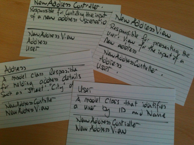

CompSci 308: Game Analysis
===================

> This is the link to the assignment: [Game](http://www.cs.duke.edu/courses/compsci308/current/assign/01_game/)

Project Journal
=======

### Time Review

* Reading Start date: 1/15, Start date: 1/16, End date: Initial completion 1/19, tweaks continued to be made afterward. Total hours: 25

* Time Breakdown (Hrs): 
> - Coding new features: 8
> - Refactoring: 1
> - Testing: 10
> - Reading: 1
> - Designing: 4
> - Debugging: 10 (Overlaps with Testing)
> - Documenting: 1
> - Meeting with Team Members

* My first significant commit happened once I had a functioning game. In other words, I first added, committed, and pushed once my ball was detecting bricks (bounces were still wonky), controls and some special features were implemented. Every time I made significant improvement I committed and pushed (e.g. I plan on fixing bouncing and collision reaction; once done, sync with Git).

* I honestly really enjoyed this project a lot. I think the hardest part for me was that I constantly tried to think of the most efficient ways to do things. For example, I tested many implementations of my "explosive" block, which was problematic because it requires me to somehow save block relative locations. It seems extremely inefficient to initialize and entire 2D array of blocks and iterate across it in order to preserve location, but the implementations of additional sub-groups and children and linked lists got convoluted and much less intuitive, so after significant testing I reverted back to the 2D array. I also ran into some hitbox difficulty, mainly because it's not natural to think of "down" as "increasing y", and that wreaked havoc with my hitbox calculations. I think the best use of my time so far was actually this reflection. I learned more about how to actually implement inheritance in an effective manner and it's so much cleaner. 

### Commits

* I committed a total of 6 times. The average size isn't significant because, aside from the first commit, the rest of my commits were usually just tweaks or debugging changes. No large-scale adjustments were made. 

* I do not feel like they accurately represent the "story" because there's no swimming pool filled with tears in that repo.
> - In all actuality , it's not really representative because I didn't commit often enough to illustrate the history well. One moment there's nothing, next there's a ton of stuff. 

* "Update 1": This was the first commit I made, and it essentially laid out the framework for me to fix. At this point, essentially everything I would need, minus some additional features, had been implemented to some degree. This was my big "nothing to everything" commit. This was one "packaged" commit because it represented everything I had done up to this point; I had reached my first milestone. Unfortunately, the nature of such a big milestone makes it such that it is not reasonable to expect someone to understand completely what's going on; there's simply too much going on. 

* "Cleaned up and commented, removed magic numbers. Some classes are not used, those have been left in their potentially broken state. can delete if necessary": as the commit message says, this was my first version of a "completed game". Most bugs had been sorted out, the game became playable. Features like cheat codes were implemented, and there was selective usage of "magic numbers" that I fixed. This was packaged this way because it essentially represents a rough, pre-release, beta edition of my game. Again, the differences between this commit and the last are quite significant and difficult to follow (by nature of having one big management class), but more manageable than Update 1.

### Conclusions
* I think I underestimated the size of this project, but I also planned on getting it done early at any cost (had a busy weekend scheduled), so as I realized the workload, I consequently was able to adjust my schedule to work around it. My time management, for the most part, was pretty well done. I think this system works pretty well for any class; if you assume the due date is two days earlier than it is, and something comes up, you're still in the clear because you were ahead in the first place. It allows you to be flexible. 

* My hitboxes and my method calls needed a ton of editing due to poor prediction of the variables needed and the messy design I had committed to. After learning more about inheritance, it made my code so much cleaner and neater. I think this results from a too dogmatic following of my initial design method; too many parts of it were inefficient and required workarounds that didn't work. As a result, significantly greater debugging was needed to adapt. 

* Planning more would be very helpful, as well as being far more flexible in creating new classes and methods. Also, abstract classes and inheritance is awesome and would make my life so much easier. I had thought about using abstract classes initially, but I didn't understand them enough to implement them, and switch cases/extended if statements were familiar, if messy. 

* I'd replace my entire collision and brick generation segments of my code with OOP-versions of them, the versions in my master piece. It's just so cool how clean it makes it and easier to debug it makes it. 


Design Review
=======

### Status

* My code started off pretty consistent, but as things started getting added the order of some functions has changed in such a way as to still be readable, compilable, and functional, but somewhat less intuitive. However, the naming conventions and overall readability, I feel, are well done and clear; no "random" or temporary variables are used, and constants are aptly named. 

* The code is readable in that functions and methods are well named, and parameters make sense. Nothing is random or unclear as to it's intent, and naming conventions were pretty consistent. The only non-readable parts of the original code are some of the boolean expressions, because they require mathematics and manipulations that are hard to immediately visualize and verify. 

* Many of the dependencies in my code are, in my opinion, clear, though a significant portion of my variables are global variables. I would argue, however, that the globalization of some variables, such as "root", makes it easier to access and leverage. 

```java
    /**
     * Computes the effects of brick-collision
     */
         private void BrickCollide(Ball B) {
    	for (int i = 0; i < map.length; i++) {
    		for (int j = 0; j < map.length; j++) {
    			Shape intersect1 = Shape.intersect(map[i][j], B);
    			if (intersect1.getBoundsInLocal().getWidth() != -1) {
    				if ((map[i][j].Exists) && (B.getCenterY() > map[i][j].getY() && B.getCenterY() < map[i][j].getY() + BRICK_L) && ((B.getCenterX() > map[i][j].getX() - BALL_RADIUS) || (B.getCenterX() < (map[i][j].getX() + BRICK_W + BALL_RADIUS)))) {
    					B.xVel = -1*B.xVel;
    					brickhit(map[i][j], B, i, j);
    					updatescore();
    				}
    				else if ((map[i][j].Exists) && ((B.getCenterY() > map[i][j].getY() - BALL_RADIUS) || (B.getCenterY() < (map[i][j].getY() + BRICK_L + BALL_RADIUS)))) { 
    					B.yVel = -1*B.yVel;
    					brickhit(map[i][j], B, i, j);
    					updatescore();
    				}
    				if ((map[i][j].ID != 1) && (map[i][j].ID != 6)) {map[i][j].destroy();}
    			}
    		}
    	}
    }
```
> - This code functions to iterate across my 2D array of blocks, checking each one to see if contact between it and a ball has been made, and, if contact is made, where it is made and what effect that has. This code from a conceptual sense is not terribly difficult to understand, but the difficulty lies in the train-wreck of a boolean expression. The boolean expression serves to determine where the ball is making contact with the brick using relative positioning of the ball to the brick. Though complex, because it only exists in one spot in the entirety of this code, it didn't make much sense to make a separate boolean method, though using inheritance it's possible to make this look much cleaner (part of my masterpiece). 

```java
    /**
     * Handles user input
     */
    private void handleKeyInput (KeyCode code) {
        if (code == KeyCode.S) {myMover1.setY(myMover1.getY() + MOVER_SPEED);}
        else if (code == KeyCode.W) {myMover1.setY(myMover1.getY() - MOVER_SPEED);}
        if (code == KeyCode.DOWN) {myMover2.setY(myMover2.getY() + MOVER_SPEED);}
        else if (code == KeyCode.UP) {myMover2.setY(myMover2.getY() - MOVER_SPEED);}
        if (code == KeyCode.Q) {System.exit(0);}
        if (code == KeyCode.I) {
        	myMover1.setHeight(SIZE);
        	myMover2.setHeight(SIZE);
        	myMover1.setY(0);
        	myMover2.setY(0);}        
        if (code == KeyCode.DIGIT1) {myBouncer1.score = myBouncer1.score + BONUSPOINT;}
        if (code == KeyCode.DIGIT2) {myBouncer2.score = myBouncer2.score + BONUSPOINT;}
        if (code == KeyCode.P) {myBouncer2.xVel = 0; myBouncer2.yVel = 0;}
        if (code == KeyCode.O) {myBouncer2.xVel = BALL_XVEL; myBouncer2.yVel = BALL_YVEL;}
        if (code == KeyCode.C) {myBouncer1.xVel = -myBouncer1.xVel; myBouncer1.yVel = -myBouncer1.yVel;}
    }  
```
> - This code functions as what is essentially a large switch case. It handles the users' input, changing score and velocity among other things to enact the instructions of the user. It's easy to understand and read because its virtually just a switch case; if key is K, then do what K does. The naming conventions and the simplicity of this programming style make it almost universally comprehendable. 

### Design

You can put blocks of code in here like this:
```java
    /**
     * Returns sum of all values in given list.
     */
    public int getTotal (Collection<Integer> data) {
        int total = 0;
        for (int d : data) {
            total += d;
        }
        return total;
    }
```

### Alternate Designs

Here is another way to look at my design:



